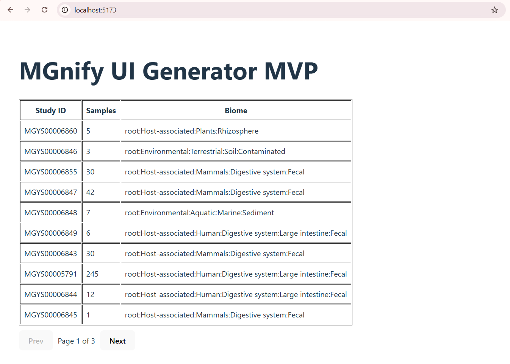

# MVP-MGnify 

## Description

**MVP-MGnify** is a Proof of Concept (PoC) demonstrating an LLM-driven UI generator for the MGnify metagenomics platform. It bridges the gap between raw scientific API data and human-friendly table interfaces by leveraging Large Language Models to interpret API schemas and dynamically generate UI configurations.

## Features

- **LLM-Driven UI Generation**: Automatically maps API fields to table columns based on user natural language prompts.
- **Graceful Fallback Chain**: System reverts to a predefined design if the LLM fails, ensuring the UI always renders.
- **Session-level Caching**: Efficiently caches API responses and schema metadata to minimize redundant network traffic.
- **Abstracted Resource Layer**: Centralized `resourceMap` that decouples UI components from specific API structures.
- **Schema Validation**: Built-in utility to verify that LLM-generated field paths exist within the actual API schema.

## Demo Image

<p align="center">
  
</p>


## Tech Stack

| Type | Technologies |
| :--- | :--- |
| **Frontend** | React, Vite, JavaScript, CSS |
| **Backend** | Node.js, Express, Cors, Dotenv |
| **LLM Integration** | Google Generative AI (Gemini Flash), OpenAI (SDK support) |

## Installation

### Prerequisites

- Node.js (v18+ recommended)
- A Gemini API Key for the backend LLM features

### Steps

1. Clone the repository:
   ```bash
   git clone https://github.com/SA0806/MVP-MGnify.git
   cd MVP-MGnify
   ```

2. Setup Server:
   ```bash
   cd server
   npm install
   echo "GEMINI_API_KEY=your_key_here" > .env
   npm start
   ```

3. Setup Client:
   ```bash
   cd ../client
   npm install
   npm run dev
   ```

## How to use

1. Start the backend server on `http://localhost:3000`.
2. Start the Vite client. The application will load the 'studies' resource by default.
3. The `App.jsx` triggers the generator with a prompt: `"Show study id and number of samples"`.
4. The system communicates with the Gemini API to retrieve a JSON design config and passes it to the `Table` component for rendering.

## Project Structure

```text
├── client/              # React Frontend
│   ├── src/components/  # UI Components (e.g., Table.jsx)
│   ├── src/generator/   # UI & LLM Logic
│   └── src/services/    # API & Resource Config
└── server/              # Express Backend
    └── server.js        # Proxy, LLM Logic, & Schema Extractor
```

